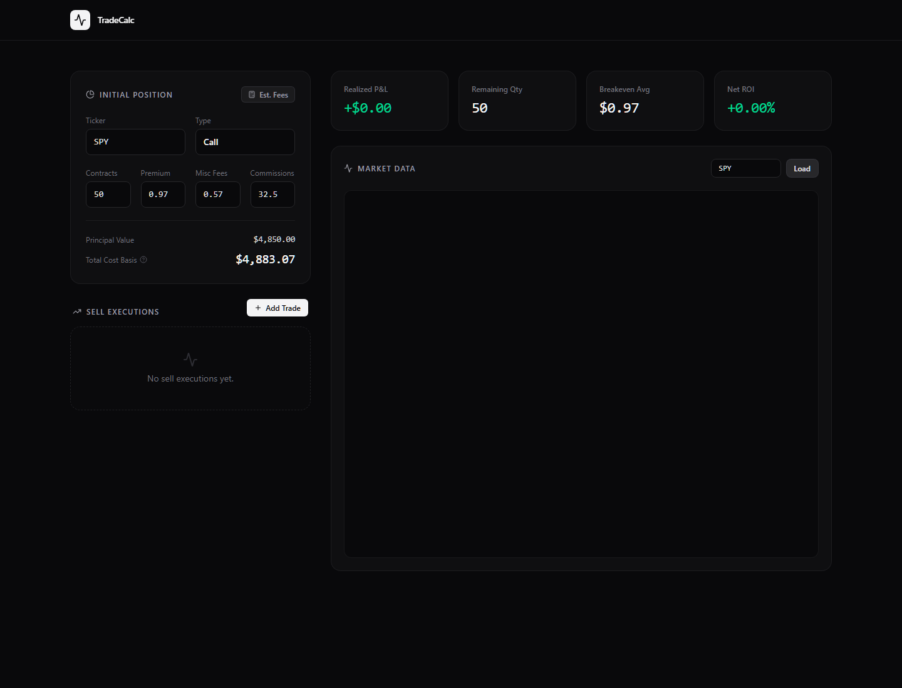
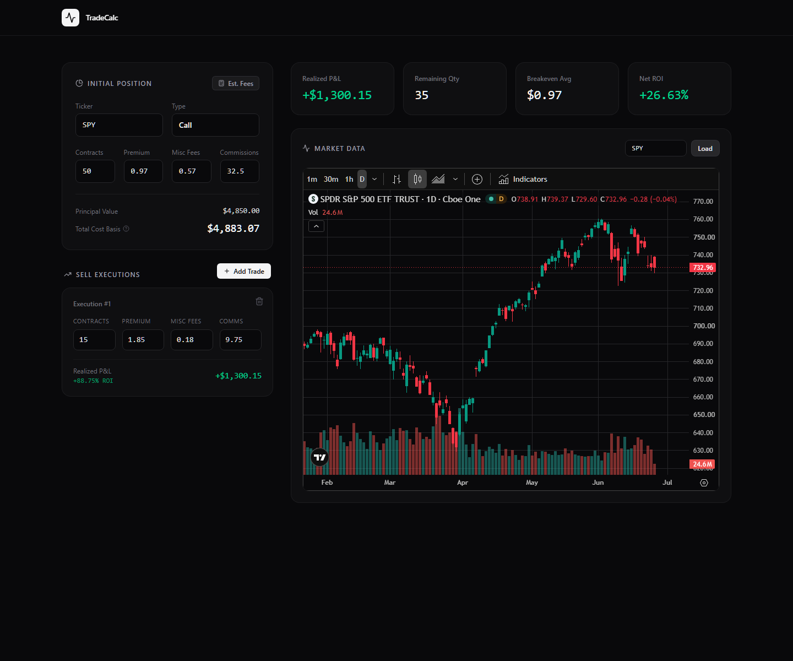

# Options TradeCalc

Options TradeCalc is a focused dashboard for tracking options trades after you open a position. Enter the original contract details, add sell executions as you scale out, and the page keeps the important numbers visible.

## What The Page Does

- Tracks the starting position: ticker, call/put type, contracts, premium, commissions, and fees.
- Calculates principal value and total cost basis.
- Adds sell executions one at a time, including partial exits.
- Shows realized profit or loss for each exit.
- Tracks remaining contract quantity after each sell.
- Summarizes realized P&L, breakeven average, and net ROI.
- Includes a market chart area so the ticker context stays on the same page.
- Provides a generic fee shortcut for quickly estimating common options fees.

## Example With A Sell Execution

After adding a sell execution, the dashboard updates the realized P&L, remaining quantity, and ROI immediately.

## When It Helps

Use it when you want a quick read on how much capital is still tied up in an options position, how profitable a partial exit was, and what remains after scaling out.
